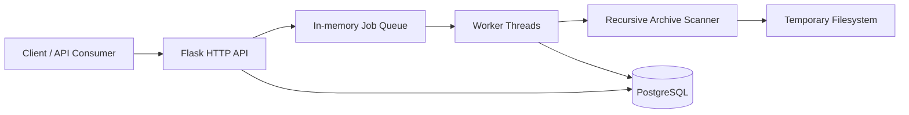
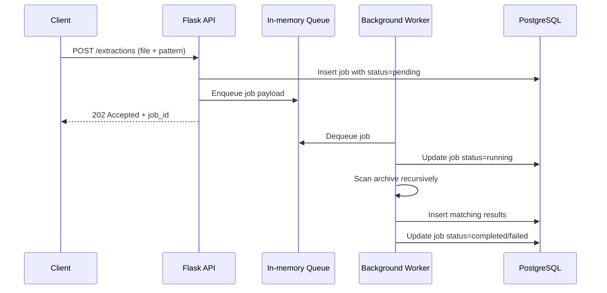

# Archive File Extractor Architecture

## 1. Purpose

Archive File Extractor is a small asynchronous file-processing service built with Flask and PostgreSQL. It accepts uploaded archive files, recursively searches their contents for files matching a glob pattern, and persists the matches for later retrieval through an HTTP API.

This document describes the current application architecture as implemented in the repository.

## 2. High-Level System View

The application is composed of four primary runtime concerns:

1. An HTTP API for job submission, status checks, and result retrieval.
2. A background worker pool that processes extraction jobs asynchronously.
3. A recursive archive scanner that traverses nested archives up to a configured depth limit.
4. A PostgreSQL database that stores jobs and matched file results.

The service runs as a single containerized Python process. The same process hosts the Flask application, the in-memory queue, and the worker threads.

## 3. Runtime Components

### 3.1 Flask API Layer

The API is implemented in [app.py](../app.py). It exposes four endpoints:

1. `GET /health` for liveness checks.
2. `POST /extractions` for submitting a new extraction job.
3. `GET /extractions/{job_id}` for reading job status.
4. `GET /extractions/{job_id}/results` for reading paginated matches.

The API layer is intentionally thin. It validates request inputs, stores a job record, enqueues the work item, and serves read-only job/result queries from the database.

### 3.2 Job Queue and Worker Pool

Job execution is asynchronous. When a job is submitted, the request handler stores the uploaded archive on disk and places a tuple of `(job_id, archive_path, pattern)` onto an in-memory `Queue`.

At startup, the application creates a fixed number of daemon worker threads equal to `CONCURRENCY`. Each worker continuously consumes queue items, marks the job as `running`, processes the archive, and then updates the job to `completed` or `failed`.

This design keeps the implementation simple and bounded:

1. Concurrency is limited by a fixed thread pool.
2. Requests do not block while archive traversal is running.
3. Job state remains queryable through the database.

### 3.3 Archive Scanner

Archive traversal is handled by `scan_archive()` in [app.py](../app.py). The scanner:

1. Extracts the current archive into a temporary directory.
2. Walks the extracted directory tree.
3. Matches files against the supplied glob pattern using `fnmatch`.
4. Persists every match to the `results` table.
5. Detects nested archives and scans them recursively using the shared `ThreadPoolExecutor`.

The recursion depth is capped by `MAX_DEPTH = 5` as a safety limit.

### 3.4 Persistence Layer

Persistence is implemented with Flask-SQLAlchemy. The application creates tables on startup via `db.create_all()` after retrying the PostgreSQL connection.

The database contains two logical entities:

1. `jobs` stores the lifecycle of each extraction request.
2. `results` stores each matched file discovered during scanning.

The current schema captures the core operational data needed by the API: job status, pattern, error text, match path, archive path, size, and timestamps.

### 3.5 Filesystem Usage

The service uses the local filesystem in two places:

1. `uploads/` stores the originally submitted archive file for each job.
2. Temporary directories are created during scanning to hold extracted contents.

Temporary directories are scoped to each scan invocation and are removed automatically by `tempfile.TemporaryDirectory()`.

## 4. Request Flow

### 4.1 Submit Extraction Job

### 4.2 Status and Results Retrieval

Clients poll `GET /extractions/{job_id}` to observe whether processing is still pending, actively running, completed, or failed. Once complete, `GET /extractions/{job_id}/results` returns paginated match records.

The results endpoint currently defaults to 20 items per page and exposes pagination metadata (`page`, `per_page`, `total`, `total_pages`).

## 5. Data Model

### 5.1 Jobs

The `jobs` table stores the lifecycle of each extraction request.

Key fields:

1. `job_id` as the primary identifier.
2. `status` to represent the current processing state.
3. `pattern` to preserve the submitted glob.
4. `error` to capture any failure message.
5. `created_at` and `completed_at` for timing and auditability.

### 5.2 Results

The `results` table stores each match found by the scanner.

Key fields:

1. `job_id` as the foreign key back to the parent job.
2. `matched_path` for the relative path within the extracted archive tree.
3. `archive_path` for the source archive being processed.
4. `size` for the file size in bytes.
5. `created_at` for the insertion timestamp.

## 6. Configuration and Deployment

The application is configured through environment variables:

1. `DB_HOST`, `DB_PORT`, `DB_NAME`, `DB_USER`, `DB_PASSWORD` for PostgreSQL connectivity.
2. `PORT` for the HTTP listener.
3. `CONCURRENCY` for the number of worker threads.

Containerization is defined in [Dockerfile](../Dockerfile) and [docker-compose.yml](../docker-compose.yml). The compose file launches the Flask app and a PostgreSQL container on the same network, which matches the local development and test setup.

## 7. Operational Characteristics

### Strengths of the current design

1. Clear separation between request handling and background processing.
2. Bounded concurrency through a fixed worker count.
3. Simple operational model with no external task broker required.
4. Persistent job tracking and paginated result retrieval.

### Known limitations

1. The queue is in-memory, so pending jobs are not durable across restarts.
2. Results are stored with the extracted path, but not the full nested chain path required by the original interview brief.
3. The scanner extracts archives to disk before walking them, which is straightforward but not the most memory-efficient approach for very large inputs.
4. The current schema is auto-created at startup rather than managed through migrations.
5. Graceful shutdown and queue draining are not explicitly implemented.

## 8. Test Coverage

The repository includes two levels of automated checks:

1. Unit tests in [tests/test_unit.py](../tests/test_unit.py) that validate archive utility behavior.
2. Integration tests in [tests/test_integration.py](../tests/test_integration.py) that exercise the full HTTP flow against a running stack.

Together, these tests cover archive detection, extraction behavior, API validation, job submission, polling, result retrieval, and pagination.

## 9. Summary

The application is a compact, containerized Flask service that implements an asynchronous archive extraction workflow with PostgreSQL persistence. Its architecture is intentionally simple: one API process, one queue, a bounded worker pool, and a relational database. That makes it easy to reason about and suitable for local or single-instance deployment, while leaving room for future hardening around durability, migrations, and deeper archive metadata.
